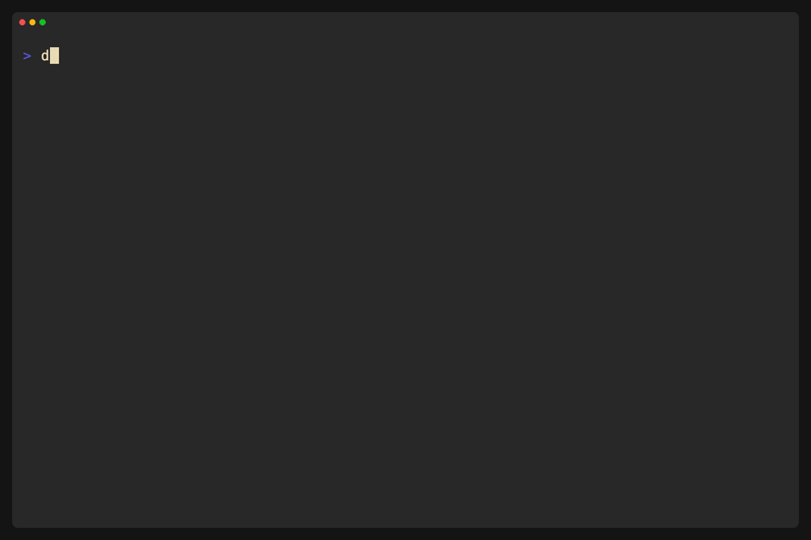

[](https://go.dev/)

# Traversql

Traversql allows you to start from a specific record in a database table and traverse through its relationships (both parent and child) to extract a graph of connected records. This can be useful for understanding data dependencies, debugging, or generating test data.



## Disclaimer

This application is currently in a very early build stage and should be used with caution.

## Getting Started

### Prerequisites

- Go (tested version 1.23)
- Access to PostgreSQL (tested version 16)
- The following environment variables must be set for the database connection:
  - `POSTGRES_HOST`
  - `POSTGRES_PORT`
  - `POSTGRES_USER`
  - `POSTGRES_PASSWORD`
  - `POSTGRES_DB`

## Installation & Usage

### Development (from cloned repository)

Clone the repository and navigate to the project directory:

```bash
git clone https://github.com/desprit-media/traversql-core.git
cd traversql-core
```

Run the application directly:

```bash
go run cmd/traversql/main.go traverse [flags]
```

### Installation (as a tool)

Install the latest version globally:

```bash
go install github.com/desprit-media/traversql-core/cmd/traversql@latest
```

Once installed, you can use the command directly:

```bash
traversql traverse [flags]
```

### Usage

The primary command is traverse:

```bash
traversql traverse [flags]
```

You can also run the latest version without installation:

```bash
go run github.com/desprit-media/traversql-core/cmd/traversql@latest traverse [flags]
```

**Flags:**

- `--table <table_name>`: The name of the table to start traversing from. (Required)
- `--schema <schema_name>`: The schema of the starting table. (Default: `public`)
- `--primary-key-fields <field1,field2,...>`: Comma-separated names of the primary key fields for the starting record. (Default: `id`)
- `--primary-key-values <value1,value2,...>`: Comma-separated values of the primary key for the starting record. (Required)
- `--output <filename>`: Write the output to the specified file instead of standard output. The file will be created if it doesn't exist or overwritten if it does.
- `--included-tables <table1,table2,...>`: Comma-separated names of tables to include in the traversal. If not specified, all tables are included.
- `--excluded-tables <table1,table2,...>`: Comma-separated names of tables to exclude from the traversal.
- `--included-schemas <schema1,schema2,...>`: Comma-separated names of schemas to include in the traversal.
- `--follow-parents`: Whether to follow parent relationships during traversal. (Default: `true`)
- `--follow-children`: Whether to follow child relationships during traversal. (Default: `true`)

## Example

Traverse records related to the order with ID 1 in the `public.orders` table and save the output to `orders_graph.sql`:

```bash
traversql traverse --table orders --primary-key-values 1 --output orders_graph.sql
```

Traverse records related to a user with a composite primary key (user_id, tenant_id) and print to the console:

```bash
traversql traverse --table users --primary-key-fields user_id,tenant_id --primary-key-values 456,abc --follow-children=false
```
